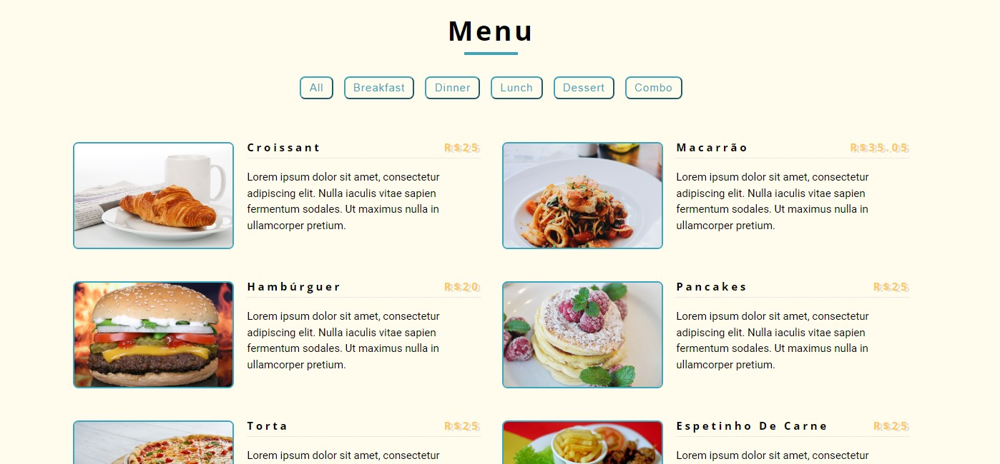

## Menu de Restaurante

### Conceitos importante nesse projeto:

- arrays
- objetos
- forEach()
- DOMContentLoaded
- map, reduce e filter
- innerHTML
- método includes

 

Com algumas mudanças.

[Projetos em JavaScript puro](https://www.freecodecamp.org/portuguese/news/40-projetos-em-javascript-para-iniciantes-ideias-simples-para-comecar-a-programar-em-js/#como-criar-uma-p-gina-de-menu-de-restaurante)
